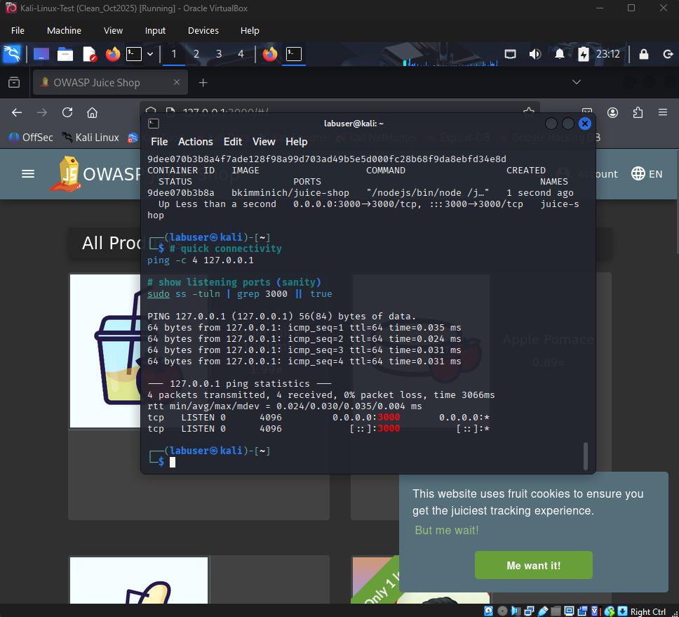
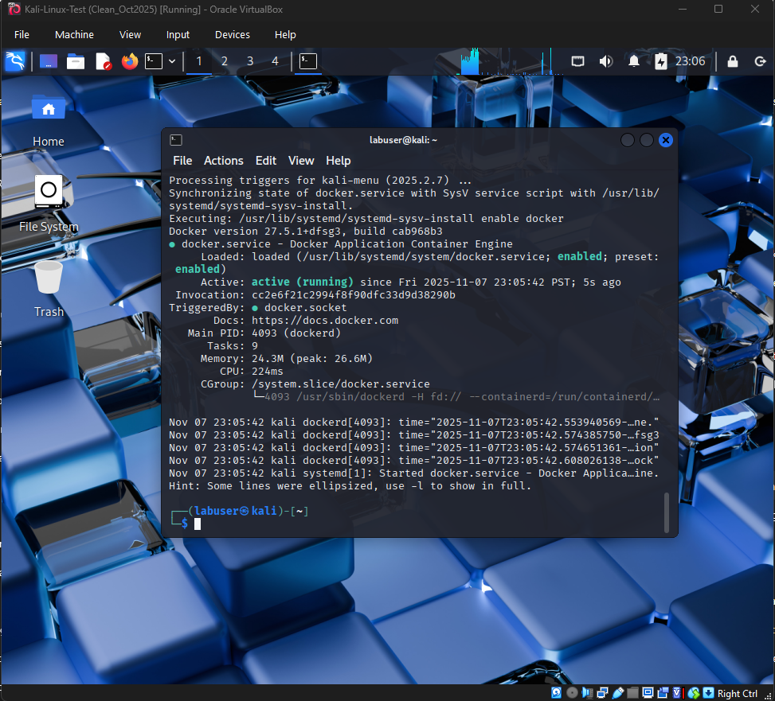
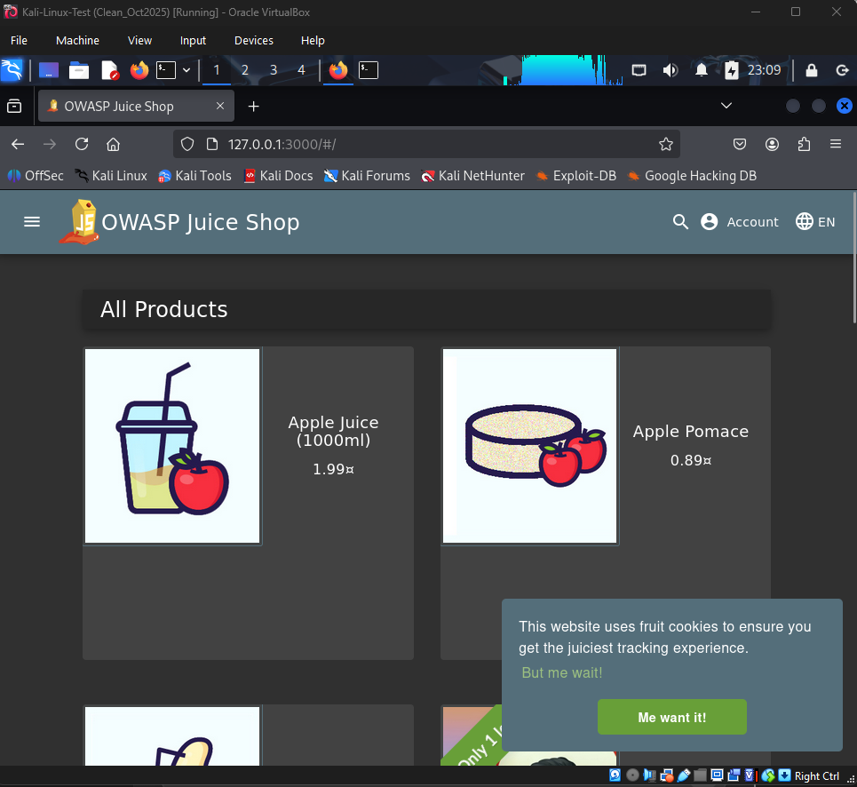

### `Labs/2025-11-07_Vulnerability_Scan.md`


# 2025-11-07 — Vulnerability Scan Lab (Docker: OWASP Juice Shop)

**Phase:** Google Cybersecurity Certificate  
**Lab Type:** Local Vulnerability Scanning  
**Environment:** Kali Linux (VirtualBox)  
**Target:** OWASP Juice Shop (localhost:3000 — Docker container)  
**Goal:** Safely perform a local vulnerability scan using Nmap to identify open ports, services, and security headers, and document mitigation strategies.

---

## Overview

This lab demonstrates a local vulnerability scan workflow using Kali Linux and Docker.  
The intentionally vulnerable OWASP Juice Shop web app was deployed locally on port 3000.  
Using Nmap’s service/version detection, HTTP enumeration, and vulnerability scripts, the lab explored how analysts identify active services, enumerate headers, and confirm that scanning occurs in a controlled environment.

---

## Environment Setup

| Component | Details |
|------------|----------|
| VM 1 | Kali Linux (Host-Only + NAT) |
| Tool | Docker 27.5.1 (Active/Running) |
| Target | OWASP Juice Shop (Node.js / Express) |
| IP / Port | 127.0.0.1 : 3000 |
| Network Mode | Localhost Only (Safe Scan Scope) |

---

## Commands Used

```bash
# Verify local connectivity
ping -c 4 127.0.0.1

# Confirm Docker is installed and active
sudo systemctl status docker

# Launch OWASP Juice Shop in Docker (temporary container)
sudo docker run -d -p 3000:3000 --name juice-shop bkimminich/juice-shop

# Confirm connectivity and visible app
sudo ss -tuln | grep 3000
firefox 127.0.0.1:3000 &

# Perform service/version scan
sudo nmap -p 3000 -sS -sV 127.0.0.1 -oN /tmp/nmap_sV_3000.txt

# Enumerate HTTP headers and routes
sudo nmap -p 3000 --script http-enum,http-headers,http-server-header 127.0.0.1 -oN /tmp/nmap_http_3000.txt

# Run vulnerability script set (safe local use)
sudo nmap -p 3000 --script vuln 127.0.0.1 -oN /tmp/nmap_vuln_3000.txt

# Stop and remove container after evidence capture
sudo docker stop juice-shop && sudo docker rm juice-shop
````

---

## Findings

| Service / App                        | Port     | Key Observations (from Nmap)                                                                                                                                                                                                                                                                                | Mitigation / Best Practice                                                                                                                                                                                                |
| ------------------------------------ | -------- | ----------------------------------------------------------------------------------------------------------------------------------------------------------------------------------------------------------------------------------------------------------------------------------------------------------- | ------------------------------------------------------------------------------------------------------------------------------------------------------------------------------------------------------------------------- |
| OWASP Juice Shop (Node.js / Express) | 3000/tcp | HTTP service returned 200 OK with full HTML response. Headers observed: `Access-Control-Allow-Origin:*`, `X-Content-Type-Options:nosniff`, `X-Frame-Options:SAMEORIGIN`, `Feature-Policy:payment 'self'`, `Cache-Control:public,max-age=0`, `Content-Type:text/html;charset=UTF-8`, `ETag`, `X-Recruiting`. | • Run intentionally vulnerable apps only in isolated VMs. <br>• Regularly patch Node/Express dependencies. <br>• Remove server/version banners and restrict CORS rules. <br>• Add CSP + HSTS headers and sanitize inputs. |
| HTTP Enumeration / Headers           | 3000/tcp | `http-enum` and `http-headers` scripts confirmed enumerable endpoints and default headers. No CVE found in local vuln scan.                                                                                                                                                                                 | • Remove debug routes. <br>• Limit exposed paths and log requests. <br>• Implement WAF or reverse proxy for production deployments.                                                                                       |

---

## Screenshots / Evidence

| Evidence                                                                                          | Description                                             |
| ------------------------------------------------------------------------------------------------- | ------------------------------------------------------- |
|                                 | Verified local connectivity (127.0.0.1 reachable)       |
|  | Docker service active and ready                         |
|              | OWASP Juice Shop web app running on localhost port 3000 |
|                  | Nmap service/version scan results showing HTTP headers  |
|              | HTTP enumeration + vulnerability script results         |

---

## Reflection

**Biggest Win:** Successfully deployed and scanned an intentionally vulnerable application in a controlled environment while documenting each step with evidence.

**Hardest Challenge:** Fixing Docker and network issues before the lab ran properly (ensuring Kali could reach localhost port 3000 inside VirtualBox).

**Skill Improved:** Service enumeration and header analysis with Nmap, plus safe scanning practices for lab targets.

**Connection to Next Phase:** Builds the foundation for network vulnerability assessment in later labs and Security+ modules.

**Key Takeaways:**

* Use `nmap -sV` and script modules to detect services and headers.
* Keep Docker isolated in a Host-Only or NAT lab network.
* Always collect evidence (systematically named screenshots) for each stage.
* Reflect after execution to solidify command purpose and outcomes.

---

**Status:** Completed — All deliverables captured and committed on 2025-11-07
